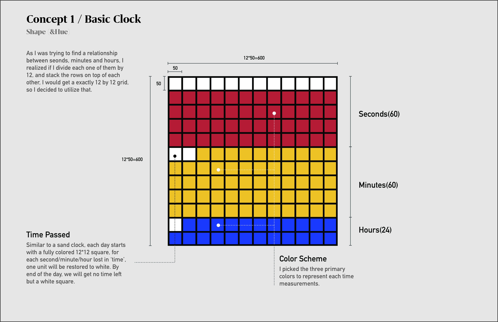
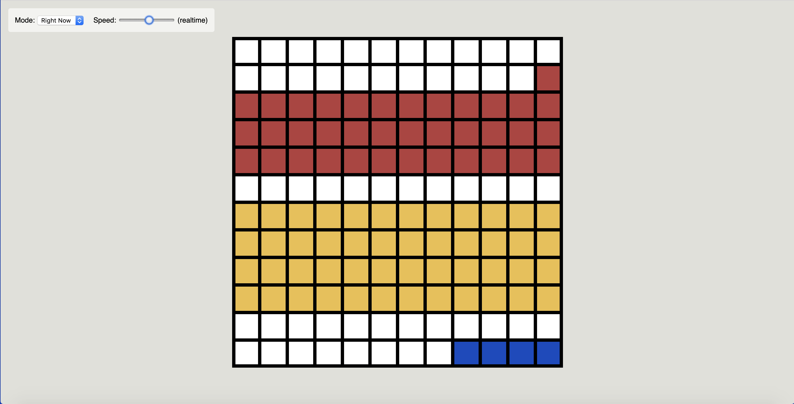

# Basic Clock

## 1/ Concept & Sketch

Similar to a sand clock, each day starts with a fully colored 12*12 square, for each second/minute/hour lost in ‘time’, one unit will be recolored to white. By end of the day, we will get no 'time' left but a white square.
***Related retinal variables: Shape & Hue***




## 2/ P5.js Code Implementation

```Javascript
function setup() { 
  createCanvas(600, 600);

} 

function draw() { 
  var now = clock();
  //background color
  background(255);
  
  //second colored block
  fill(182,62,62);
  rect(0,0,width,250);

  //miunte colored block
  fill(237,192,69);
  rect(0,250,width,250);
    
  //hour colored block
  fill(22,70,193);
  rect(0,500,width,100);
    
  //second proceeding blocks
  fill(255);
  noStroke();
  rect(0,0,50*now.sec,50)
  rect(0,50,-600+(50*now.sec),50)
  rect(0,100,-1200+(50*now.sec),50)
  rect(0,150,-1800+(50*now.sec),50)
  rect(0,200,-2400+(50*now.sec),50)

  //minute proceeding blocks
  fill(255);
  noStroke();
  rect(0,250,50*minute(),50)
  rect(0,300,-600+(50*now.min),50)
  rect(0,350,-1200+(50*now.min),50)
  rect(0,400,-1800+(50*now.min),50)
  rect(0,450,-2400+(50*now.min),50)
  
  //hour proceeding blocks
  fill(255);
  noStroke();
  rect(0,500,50*now.hours,50)
  rect(0,550,-600+(50*now.hours),50)
 
  //background grid 
  stroke(0);
  strokeWeight(12);
  fill(255,255,255,0);
  rect(0,0,width,height);
  for (var x = 0; x < width; x += width / 12) {
		for (var y = 0; y < height; y += height / 12) {
			stroke(0);
			strokeWeight(6);
			line(x, 0, x, height);
			line(0, y, width, y);
    }
  } 
}

```

## 3/ Screenshot of Final Design

Current Time: 20:12:23
