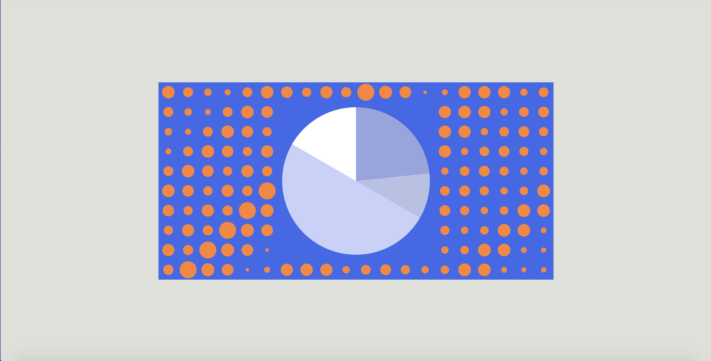

#Beating Dots

##Concept & Sketch

Overlapping each circle on top of each other, as time proceeds forward each arc starts to complete their own cycle and return to the starting point.

***Related retinal variables: Shape & Size***


##P5.js Code Implementation

```Javascript
function setup() { 
  createCanvas(800,400);
  rectMode(CENTER)
} 

function draw(){
  //Background color setting
  var now = clock();
  background(67,100,235);
  
  //Background dots
  fill(255,132,49)
  noStroke();
  var diameter =40
  for (var i=0; i<width/diameter; i++){
    for (var j=0; j<height/diameter; j++){
      ellipse(
        diameter/2 +i*diameter,
        diameter/2 +j*diameter,
        diameter*noise(now.progress.sec+i+j),
        diameter*noise(now.progress.sec+i+j),
      );
    }
  }
  
  //Background square
  fill(67,100,235)
  noStroke();
  rect(400,200,320,320)
  
  //Background circle for the clock
  fill(255);
  noStroke();
  ellipse(400,200,299,299);
  
  //Minute's cycle
  fill(89,100,235,75);
  arc(400,200,300,300,1.5*PI,(now.min/30*PI-HALF_PI+0.0001));

  //Hour's cycle
  fill(67,100,235,75);
  arc(400,200,300,300,1.5*PI,(now.hours/12*PI-HALF_PI+0.0001)); 

  //Second's cycle  
  fill(0,0,0,20);
  arc(400,200,300,300,1.5*PI,(now.sec/30*PI-HALF_PI+0.0001));
  
}

```

##Screenshot of Final Design

Current Time: 20:14:15
