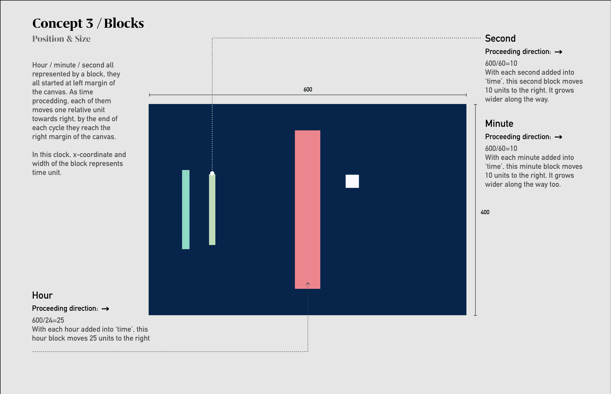
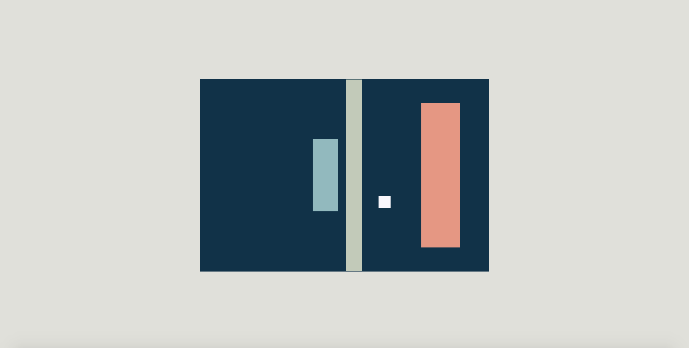

# Blocks

## 1/Concept & Sketch

Hour/minute/second all represented by a block, they all started at left margin of the canvas. As time procedding, each of them moves one relative unit towards right, by the end of each cycle they reach the right margin of the canvas. In this clock, x-coordinate and width of the block represents time unit.

***Related retinal variables: Position & Size***




## 2/P5.js Code Implementation

```Javascript
function setup() {
  createCanvas(600, 400)
  noStroke()
  rectMode(CENTER)
  frameRate(60) 
}

function draw() {
  var now = clock();
  background(2,50,74)

  length = height*now.progress.sec
  if (length < 0) {
    length = height
  }
  
//Hour
fill(242, 147, 126)
rect(now.hours*25, 200, now.hours*4, 300);

//Minute  
  fill(136, 186, 191)
  rect(now.min*10, 200, now.min*2, 150);
  
//Second
  fill(192, 203, 183)
  rect(now.sec*10, 200, now.sec, length);
  
//Second block
  fill(250, 247, 252)
  rectMode(CENTER);
  translate(width/2 , height/2);
  translate(p5.Vector.fromAngle(now.sec, 100));
  rect(0, 0, 25, 25);

}

```
## 3/Feedbacks on Refinements
Use `length = height*now.progress.sec` for the second's block to make it progresses smoothly.

## 4/Screenshot of Final Design

Current Time: 20:26:35
