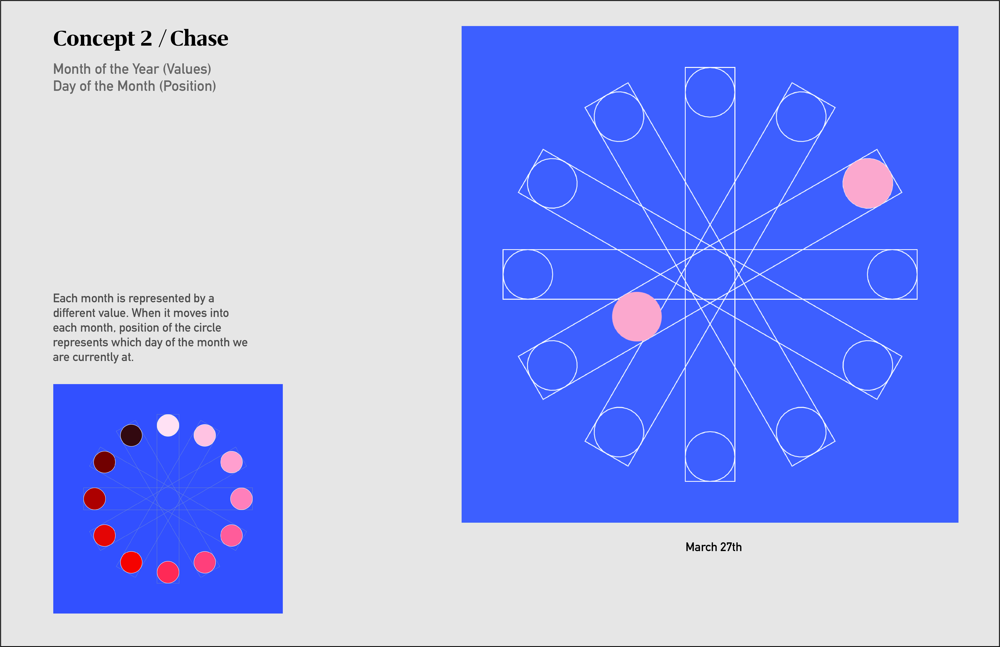

# Chase

## 1/ Concept & Sketch

Each month is represented by a different value. When it moves into each month, position of the circle represents which day of the month we are currently at.

***Value ---> Month of the Year (totally number:12)***

***Position--->Day of the Month (totally number: varied by month)***




## 2/ P5.js Code Implementation

```Javascript
let angle = 30;
let angle2 = 30;

function setup() {
  createCanvas(600, 600);
  angleMode(DEGREES);
}

function draw() {
  var now = clock();
  m = now.month;
  var r = 14;
  var rc = 30;
  var w = 480;
  // d=now.day;


  //Background color setting
  background(67, 100, 235);
  // noFill();
  // stroke(255);
  noStroke();
  strokeWeight(1);

  //6 rectangles
  push();
  translate(300, 300);
  fill(255, 30);
  rotate(angle);
  rectMode(CENTER);

  rect(0, 0, w, 60, rc);
  rotate(angle);
  rect(0, 0, w, 60, rc);
  rotate(angle);
  rect(0, 0, w, 60, rc);
  rotate(angle);
  rect(0, 0, w, 60, rc);
  rotate(angle);
  rect(0, 0, w, 60, rc);
  rotate(angle);
  rect(0, 0, w, 60, rc);
  pop();

  noStroke();

  if (m === 1) {
    push();
    translate(300, 300);
    fill(255, 229, 230, 70);
    noStroke();
    rotate(90);
    rectMode(CENTER);
    rect(0, 0, w, 60, rc);
    pop();

    push();
    translate(300, 300);
    fill(255, 229, 230);
    d = now.day++;
    ellipse(0, -220, 60);
    ellipse(0, -220 + (r * d), 60);
    pop();
  } else if (m === 2) {
    push();
    translate(300, 300);
    fill(255, 204, 203, 70);
    // stroke(255, 204, 203);
    // strokeWeight(2);
    noStroke();

    rotate(120);
    rectMode(CENTER);
    rect(0, 0, w, 60, rc);
    pop();

    push();
    translate(300, 300);
    rotate(30);
    fill(255, 204, 203);
    d = now.day++;
    ellipse(0, -220, 60);
    ellipse(0, -220 + (r * d), 60);
    pop();
  } else if (m === 3) {
    push();
    translate(300, 300);
    fill(255, 178, 178, 70);
    // stroke(255, 178, 178);
    // strokeWeight(2);
    noStroke();

    rotate(150);
    rectMode(CENTER);
    rect(0, 0, w, 60, rc);
    pop();

    push();
    translate(300, 300);
    rotate(60);
    fill(255, 178, 178);
    d = now.day++;
    ellipse(0, -220, 60);
    ellipse(0, -220 + (r * d), 60);
    pop();
  } else if (m === 4) {
    push();
    translate(300, 300);
    fill(255, 154, 154, 70);
    // stroke(255, 154, 154);
    // strokeWeight(2);
    noStroke();

    rotate(180);
    rectMode(CENTER);
    rect(0, 0, w, 60, rc);
    pop();

    push();
    translate(300, 300);
    rotate(90);
    fill(255, 154, 154);
    d = now.day++;
    ellipse(0, -220, 60);
    ellipse(0, -220 + (r * d), 60);
    pop();
  } else if (m === 5) {
    push();
    translate(300, 300);
    fill(255, 127, 126, 70);
    // stroke(255, 127, 126);
    // strokeWeight(2);
    noStroke();

    rotate(210);
    rectMode(CENTER);
    rect(0, 0, w, 60, rc);
    pop();

    push();
    translate(300, 300);
    rotate(120);
    fill(255, 127, 126);
    d = now.day++;
    ellipse(0, -220, 60);
    ellipse(0, -220 + (r * d), 60);
    pop();
  } else if (m === 6) {
    push();
    translate(300, 300);
    fill(255, 102, 102, 70);
    // stroke(255, 102, 102);
    // strokeWeight(2);
    noStroke();

    rotate(240);
    rectMode(CENTER);
    rect(0, 0, w, 60, rc);
    pop();

    push();
    translate(300, 300);
    rotate(150);
    fill(255, 102, 102);
    d = now.day++;
    ellipse(0, -220, 60);
    ellipse(0, -220 + (r * d), 60);
    pop();
  } else if (m === 7) {
    push();
    translate(300, 300);
    fill(255, 78, 78, 70);
    // stroke(255, 78, 78);
    // strokeWeight(2);
    noStroke();

    rotate(90);
    rectMode(CENTER);
    rect(0, 0, w, 60, rc);
    pop();

    push();
    translate(300, 300);
    rotate(180);
    fill(255, 78, 78);
    d = now.day++;
    ellipse(0, -220, 60);
    ellipse(0, -220 + (r * d), 60);
    pop();
  } else if (m === 8) {
    push();
    translate(300, 300);
    fill(229, 25, 26, 70);
    // stroke(229, 25, 26);
    // strokeWeight(2);
    noStroke();

    rotate(120);
    rectMode(CENTER);
    rect(0, 0, w, 60, rc);
    pop();

    push();
    translate(300, 300);
    rotate(210);
    fill(229, 25, 26);
    d = now.day++;
    ellipse(0, -220, 60);
    ellipse(0, -220 + (r * d), 60);
    pop();
  } else if (m === 9) {
    push();
    translate(300, 300);
    fill(215, 38, 38, 70);
    // stroke(215, 38, 38);
    // strokeWeight(2);
    noStroke();

    rotate(150);
    rectMode(CENTER);
    rect(0, 0, w, 60, rc);
    pop();

    push();
    translate(300, 300);
    rotate(240);
    fill(215, 38, 38);
    d = now.day++;
    ellipse(0, -220, 60);
    ellipse(0, -220 + (r * d), 60);
    pop();
  } else if (m === 10) {
    push();
    translate(300, 300);
    fill(176, 1, 0, 70);
    // stroke(176, 1, 0);
    // strokeWeight(2);
    noStroke();

    rotate(180);
    rectMode(CENTER);
    rect(0, 0, w, 60, rc);
    pop();

    push();
    translate(300, 300);
    rotate(270);
    fill(176, 1, 0);
    d = now.day++;
    ellipse(0, -220, 60);
    ellipse(0, -220 + (r * d), 60);
    pop();
  } else if (m === 11) {
    push();
    translate(300, 300);
    fill(128, 0, 0, 70);
    // stroke(128, 0, 0);
    // strokeWeight(2);
    noStroke();

    rotate(210);
    rectMode(CENTER);
    rect(0, 0, w, 60, rc);
    pop();

    push();
    translate(300, 300);
    rotate(300);
    fill(128, 0, 0);
    d = now.day++;
    ellipse(0, -220, 60);
    ellipse(0, -220 + (r * d), 60);
    pop();
  } else if (m === 12) {
    push();
    translate(300, 300);
    fill(78, 0, 0, 70);
    // stroke(78, 0, 0);
    // strokeWeight(2);
    noStroke();

    rotate(240);
    rectMode(CENTER);
    rect(0, 0, w, 60, rc);
    pop();

    push();
    translate(300, 300);
    rotate(330);
    fill(78, 0, 0);
    d = now.day++;
    ellipse(0, -220, 60);
    ellipse(0, -220 + (r * d), 60);
    pop();

  };
}
```

## 3/ Screenshot of Final Design

