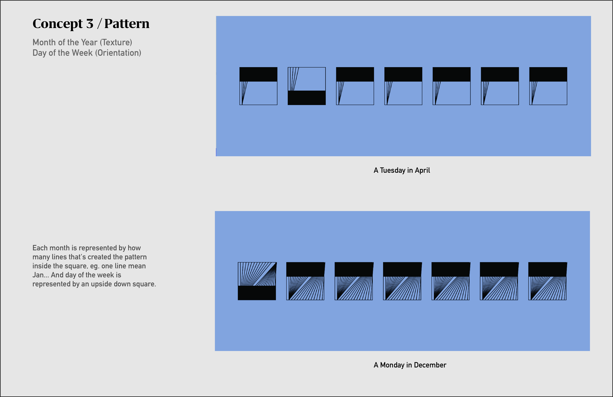
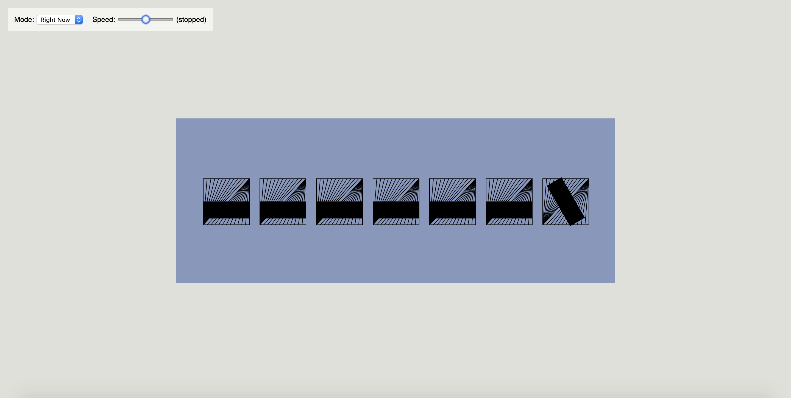
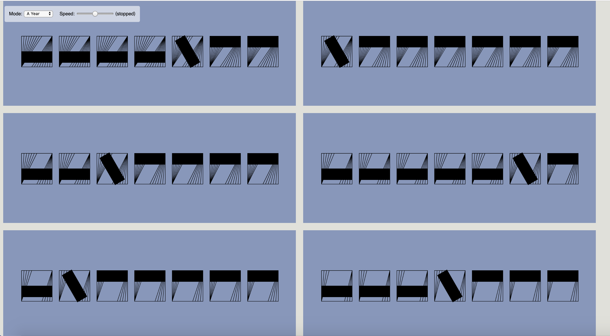

# Pattern

## 1/ Concept & Sketch

Each month is represented by how many lines left inside the square that's created the pattern, eg. 12 (*2) line mean Jan... And day of the week is represented by an rotated rectangle.

***Texture ---> Month of the Year (totally number:12)***

***Orientation--->Day of the Week (totally number: 7)***




## 2/ P5.js Code Implementation

```Javascript
et angle = 30;

function setup() {
  createCanvas(800, 300);
  angleMode(DEGREES);

}

function draw (){
  
  
  background(133,151,189);
  noFill();
  stroke(0);
  strokeWeight(1);
    
  var x1=50;
  var y1=110;
  var x2=50;
  var y2=194;
  var sw=84;
  var offset=103;
  var now = clock();
  
  for (x=50; x<=width-50;x+=103) {
      rect(x, 110, 84, 84);
  }
  
  for (z=now.month;z<14;z++){
    for (i=0;i<7; i++) {
      line( x1+offset*i, y1, x2+offset*i, y2); 
    }
    x1+=7;
  }

  for (z=now.month;z<14;z++){
    for (i=0;i<7; i++) {
      line( 134+offset*i, y1, x2+offset*i+84, y2); 
    }
    x2-=7;
  }
  
  fill(0);

  
  var wd=now.weekday;
  var s=54;
  
if (wd === 1) {
    push();
    rectMode(CENTER);
    translate(92,152)
    rotate(60)
    rect(0, 0, sw, 30);
    pop();
    rect(50 + offset * 1, 110, sw, 30)
    rect(50 + offset * 2, 110, sw, 30)
    rect(50 + offset * 3, 110, sw, 30)
    rect(50 + offset * 4, 110, sw, 30)
    rect(50 + offset * 5, 110, sw, 30)
    rect(50 + offset * 6, 110, sw, 30)
  } else if (wd === 2) {
    rect(50, 152, sw, 30);
    push();
    rectMode(CENTER);
    translate(92+offset*1,152)
    rotate(60)
    rect(0, 0, sw, 30);
    pop();
    rect(50 + offset * 2, 110, sw, 30)
    rect(50 + offset * 3, 110, sw, 30)
    rect(50 + offset * 4, 110, sw, 30)
    rect(50 + offset * 5, 110, sw, 30)
    rect(50 + offset * 6, 110, sw, 30)
  } else if (wd === 3) {
    rect(50, 152, sw, 30);
    rect(50 + offset * 1, 152, sw, 30)
    push();
    rectMode(CENTER);
    translate(92+offset*2,152)
    rotate(60)
    rect(0, 0, sw, 30);
    pop();   
    rect(50 + offset * 3, 110, sw, 30)
    rect(50 + offset * 4, 110, sw, 30)
    rect(50 + offset * 5, 110, sw, 30)
    rect(50 + offset * 6, 110, sw, 30)
  } else if (wd === 4) {
    rect(50, 152, sw, 30);
    rect(50 + offset * 1, 152, sw, 30)
    rect(50 + offset * 2, 152, sw, 30)
    push();
    rectMode(CENTER);
    translate(92+offset*3,152)
    rotate(60)
    rect(0, 0, sw, 30);
    pop();
    rect(50 + offset * 4, 110, sw, 30)
    rect(50 + offset * 5, 110, sw, 30)
    rect(50 + offset * 6, 110, sw, 30)
  } else if (wd === 5) {
    rect(50, 152, sw, 30);
    rect(50 + offset * 1, 152, sw, 30)
    rect(50 + offset * 2, 152, sw, 30)
    rect(50 + offset * 3, 152, sw, 30)
    push();
    rectMode(CENTER);
    translate(92+offset*4,152)
    rotate(60)
    rect(0, 0, sw, 30);
    pop();
    rect(50 + offset * 5, 110, sw, 30)
    rect(50 + offset * 6, 110, sw, 30)
  } else if (wd === 6) {
    rect(50, 152, sw, 30);
    rect(50 + offset * 1, 152, sw, 30)
    rect(50 + offset * 2, 152, sw, 30)
    rect(50 + offset * 3, 152, sw, 30)
    rect(50 + offset * 4, 152, sw, 30)
    push();
    rectMode(CENTER);
    translate(92+offset*5,152)
    rotate(60)
    rect(0, 0, sw, 30);
    pop();
    rect(50 + offset * 6, 110, sw, 30)
  } else if (wd === 7) {
    rect(50, 152, sw, 30);
    rect(50 + offset * 1, 152, sw, 30)
    rect(50 + offset * 2, 152, sw, 30)
    rect(50 + offset * 3, 152, sw, 30)
    rect(50 + offset * 4, 152, sw, 30)
    rect(50 + offset * 5, 152, sw, 30)
    push();
    rectMode(CENTER);
    translate(92+offset*6,152)
    rotate(60)
    rect(0, 0, sw, 30);
    pop();

  }
    
  
}
```
## 3/ Feedbacks on Refinements
- change the orientation's degree to make it more obvious


## 4/ Screenshot of Final Design

7th Day of the Week in January



