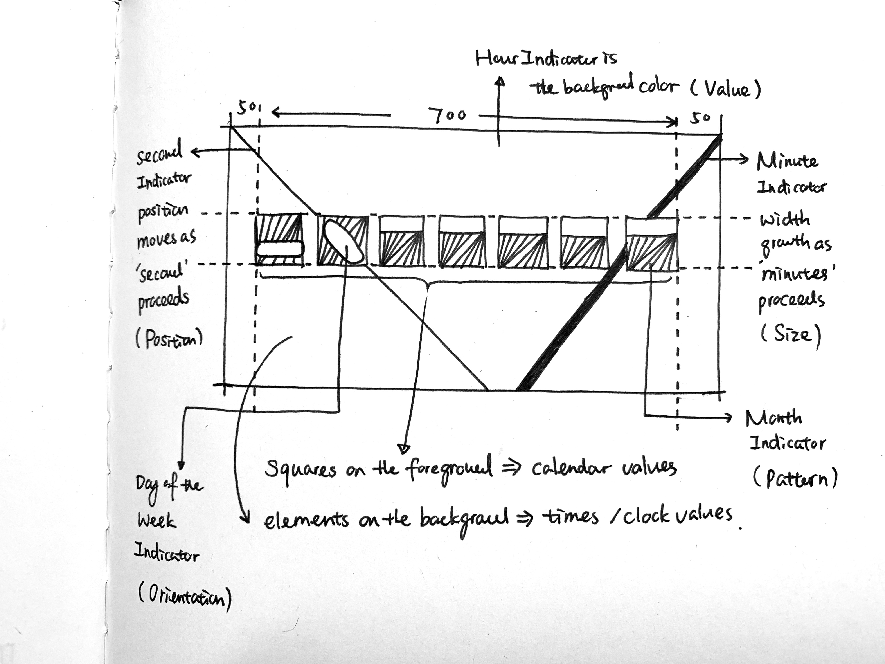
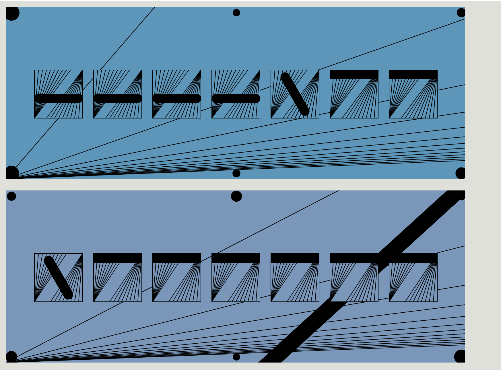
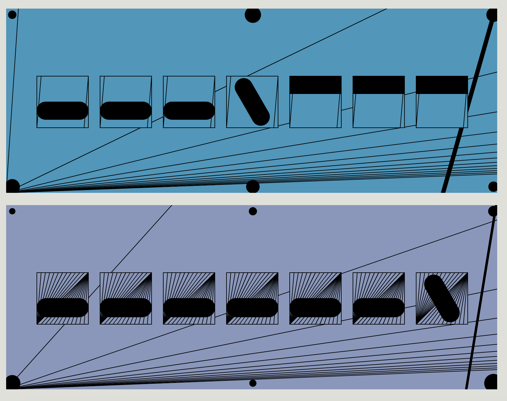

# Time&Line

## 1/ Concept & Sketch

Looking at graphical representations of time throughout history, quite often we use the linear metaphor, such as 'timeline' or seconds and minutes' ticks in a physical clock. We speak of ‘long’ and ‘short’ times, of ‘intervals’ of ‘before’ and ‘after’ – all implicit metaphors which depend upon a mental picture of time as a linear continuum.

In this concept I want to use retinal variables of a LINE (such as size, position, color of a line etc.) to represent different aspect of TIME. The whole canvas is divided into two parts: foreground and background. Squares in the foreground indicate calendar values while elements in the backgroud represent clock time values.

Each month is represented by how many lines left inside the square that's created the pattern, eg. 12 (*2) line mean Jan... And day of the week is represented by a different orientated pill shape. In the background, left line is second's indicator, it's X coordinates moves 13 units towards right margin as ‘second’ proceeds. Right line is the minute's indicator, width of the line grows as ‘minute’ proceeds. 

***Texture ---> Month of the Year (totally number:12)***
***Orientation--->Day of the Week (totally number: 7)***
***Position--->Second***
***Size--->Minute***
***Value--->Hour***


Hand Sketch


Digital Sketch


## 2/ P5.js Code Implementation

```Javascript
let angle = 30;

function setup() {
  createCanvas(800, 300);
  angleMode(DEGREES);
}

function draw() {

  var now = clock();
  var offset = 103;
  var x1 = 50;
  var y1 = 110;
  var x2 = 50;
  var y2 = 194;
  var sw = 84; //pill-shape width
  var sh = 15+now.moon*20; //pill-shape height
  var rc = 30; // rounded corner

  background(now.hour*10+15, 151, 189);
  // background(133, 151, 189);
  noFill();
  stroke(0);
  strokeWeight(1);


  //Second
  push();
  strokeWeight(1);
  for (x = now.sec; x <= width; x +=60) {
  line(x*10, 0, 0, 300);
  };
  pop();


  //Minute
  push();
  strokeWeight(1 * now.min);
  line(800, -10, 800 - 13 * now.min, 310);
  pop();


  //Second Background Dots
  fill(0)
  // noStroke();
  var diameter = 40
  for (var i = 0; i < width / diameter; i += 9.8) {
    for (var j = 0; j < height / diameter; j+=7) {
      ellipse(
        diameter / 4 + i * diameter,
        diameter / 4 + j * diameter,
        diameter * noise(now.progress.sec + i + j),
        diameter * noise(now.progress.sec + i + j),
      );
    }
  }


  //Seven Days Square 
  for (x = 50; x <= width - 50; x += 103) {
    fill(now.hour*10+15, 151, 189);
    rect(x, 110, 84, 84);
  }

  //Month of the Year 
  for (z = now.month; z < 14; z++) {
    for (i = 0; i < 7; i++) {
      line(x1 + offset * i, y1, x2 + offset * i, y2);
    }
    x1 += 7;
  }

  for (z = now.month; z < 14; z++) {
    for (i = 0; i < 7; i++) {
      line(134 + offset * i, y1, x2 + offset * i + 84, y2);
    }
    x2 -= 7;
  }

  fill(0);

  //Day of the Week 
  var wd = now.weekday;
  var s = 54;

  if (wd === 1) {
    push();
    rectMode(CENTER);
    translate(92, 152)
    rotate(60);
    rect(0, 0, sw, sh,rc);
    pop();
    rect(50 + offset * 1, 110, sw, sh)
    rect(50 + offset * 2, 110, sw, sh)
    rect(50 + offset * 3, 110, sw, sh)
    rect(50 + offset * 4, 110, sw, sh)
    rect(50 + offset * 5, 110, sw, sh)
    rect(50 + offset * 6, 110, sw, sh)
  } else if (wd === 2) {
    rect(50, 152, sw, sh,rc);
    push();
    rectMode(CENTER);
    translate(92 + offset * 1, 152);
    rotate(60);
    rect(0, 0, sw, sh,rc);
    pop();
    rect(50 + offset * 2, 110, sw, sh)
    rect(50 + offset * 3, 110, sw, sh)
    rect(50 + offset * 4, 110, sw, sh)
    rect(50 + offset * 5, 110, sw, sh)
    rect(50 + offset * 6, 110, sw, sh)
  } else if (wd === 3) {
    rect(50, 152, sw, sh,rc);
    rect(50 + offset * 1, 152, sw, sh,rc)
    push();
    rectMode(CENTER);
    translate(92 + offset * 2, 152);
    rotate(60);
    rect(0, 0, sw, sh,rc);
    pop();
    rect(50 + offset * 3, 110, sw, sh)
    rect(50 + offset * 4, 110, sw, sh)
    rect(50 + offset * 5, 110, sw, sh)
    rect(50 + offset * 6, 110, sw, sh)
  } else if (wd === 4) {
    rect(50, 152, sw, sh,rc);
    rect(50 + offset * 1, 152, sw, sh,rc)
    rect(50 + offset * 2, 152, sw, sh,rc)
    push();
    rectMode(CENTER);
    translate(92 + offset * 3, 152)
    rotate(60)
    rect(0, 0, sw, sh,rc);
    pop();
    rect(50 + offset * 4, 110, sw, sh)
    rect(50 + offset * 5, 110, sw, sh)
    rect(50 + offset * 6, 110, sw, sh)
  } else if (wd === 5) {
    rect(50, 152, sw, sh,rc);
    rect(50 + offset * 1, 152, sw, sh,rc)
    rect(50 + offset * 2, 152, sw, sh,rc)
    rect(50 + offset * 3, 152, sw, sh,rc)
    push();
    rectMode(CENTER);
    translate(92 + offset * 4, 152)
    rotate(60)
    rect(0, 0, sw, sh,rc);
    pop();
    rect(50 + offset * 5, 110, sw, sh)
    rect(50 + offset * 6, 110, sw, sh)
  } else if (wd === 6) {
    rect(50, 152, sw, 30,rc);
    rect(50 + offset * 1, 152, sw, sh,rc)
    rect(50 + offset * 2, 152, sw, sh,rc)
    rect(50 + offset * 3, 152, sw, sh,rc)
    rect(50 + offset * 4, 152, sw, sh,rc)
    push();
    rectMode(CENTER);
    translate(92 + offset * 5, 152);
    rotate(60)
    rect(0, 0, sw, sh,rc);
    pop();
    rect(50 + offset * 6, 110, sw, sh)
  } else if (wd === 7) {
    rect(50, 152, sw, sh,rc);
    rect(50 + offset * 1, 152, sw, sh,rc)
    rect(50 + offset * 2, 152, sw, sh,rc)
    rect(50 + offset * 3, 152, sw, sh,rc)
    rect(50 + offset * 4, 152, sw, sh,rc)
    rect(50 + offset * 5, 152, sw, sh,rc)
    push();
    rectMode(CENTER);
    translate(92 + offset * 6, 152)
    rotate(60)
    rect(0, 0, sw, sh,rc);
    pop();

  }


}
```

## 3/ Screenshot of Final Design


Variations Within A Day



Variations Within A Year

