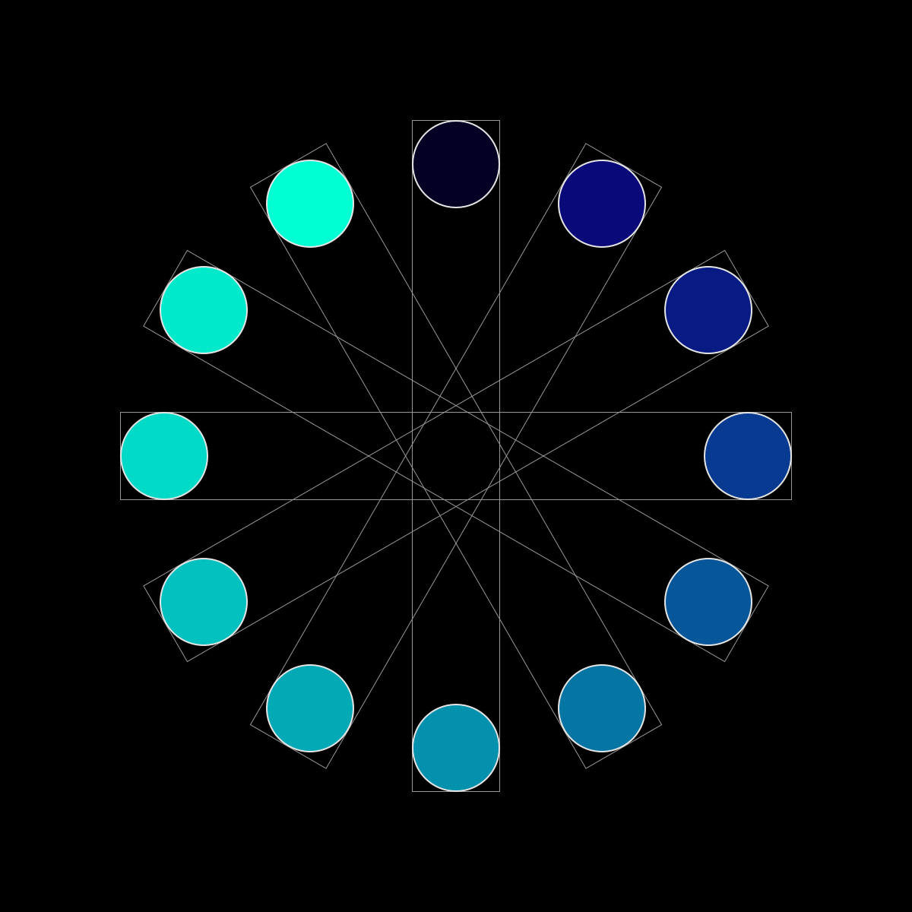
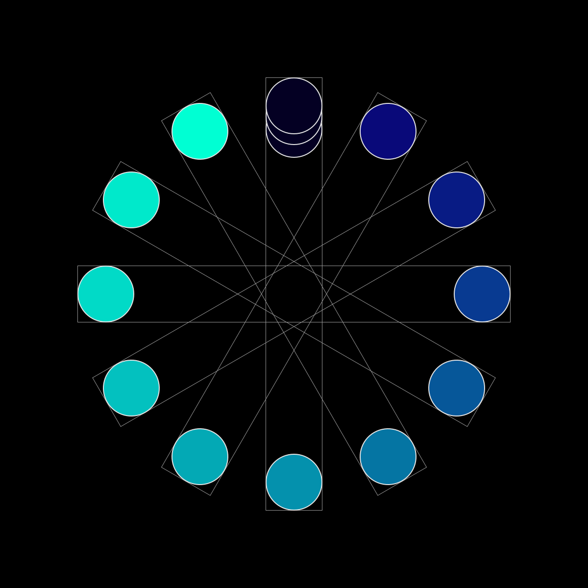
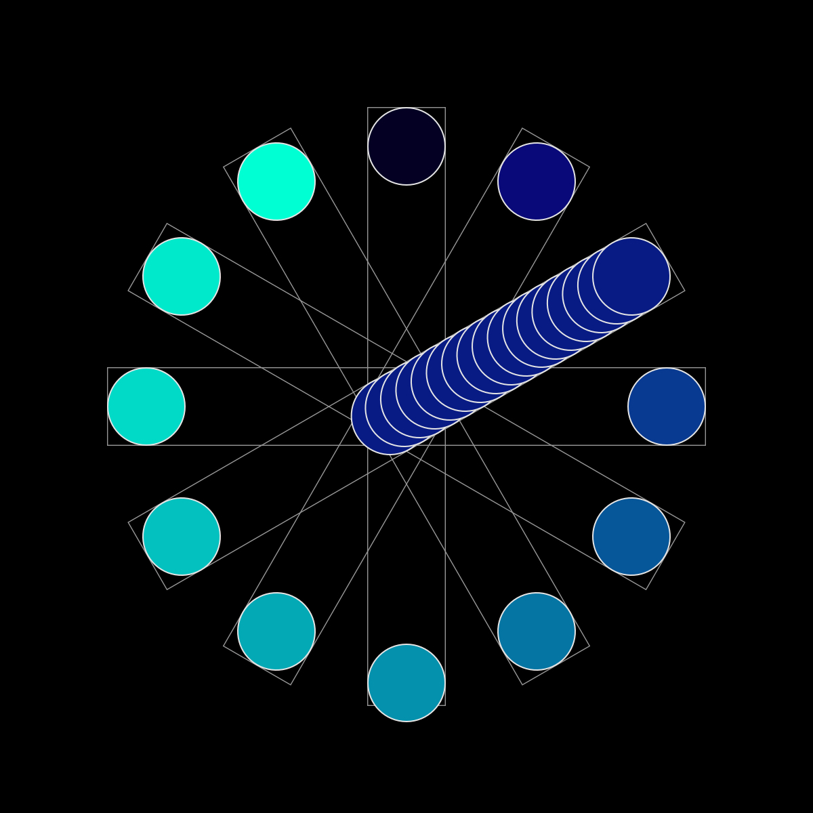
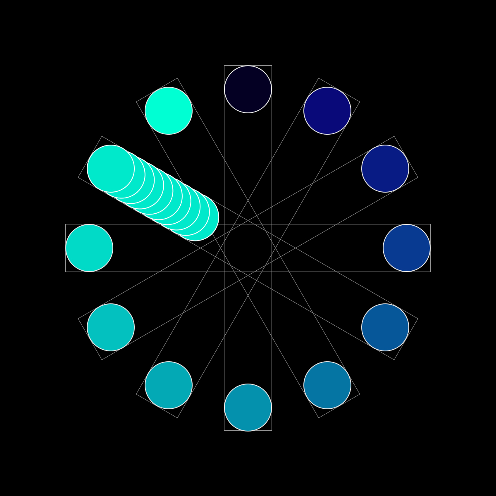
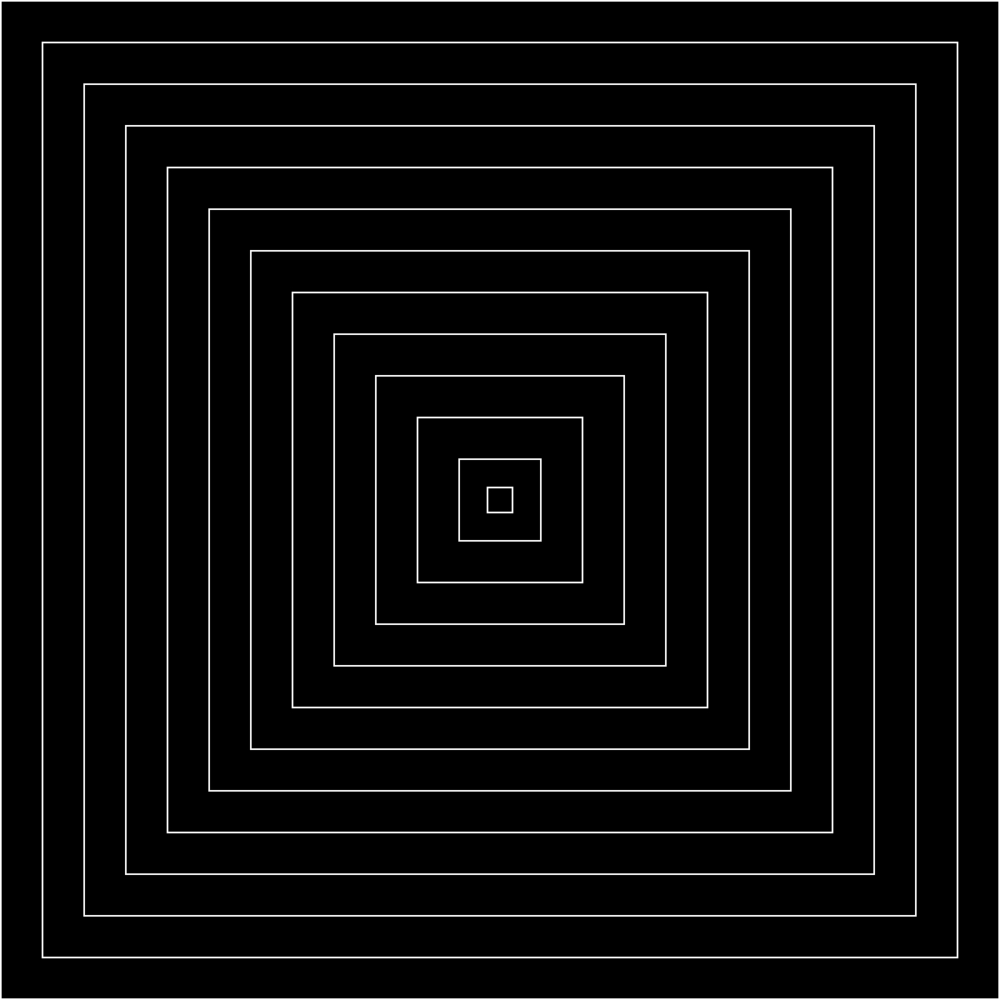
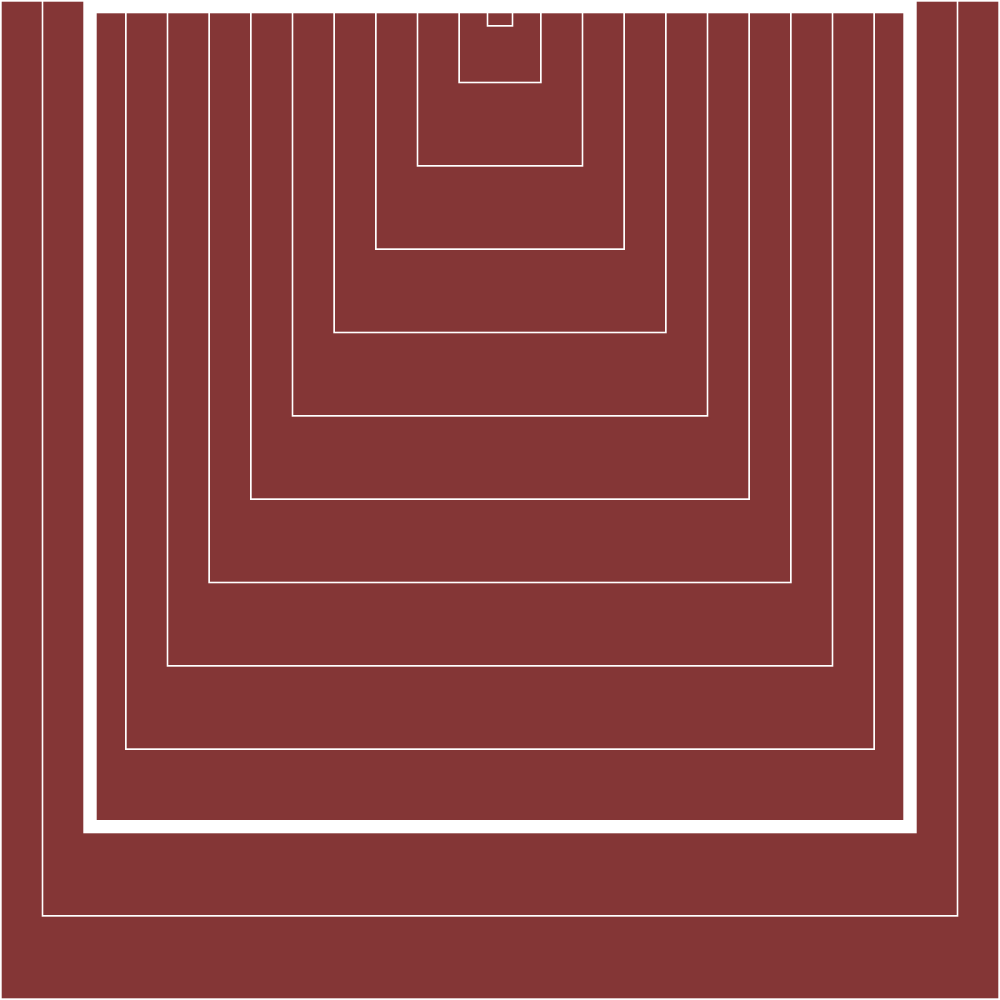
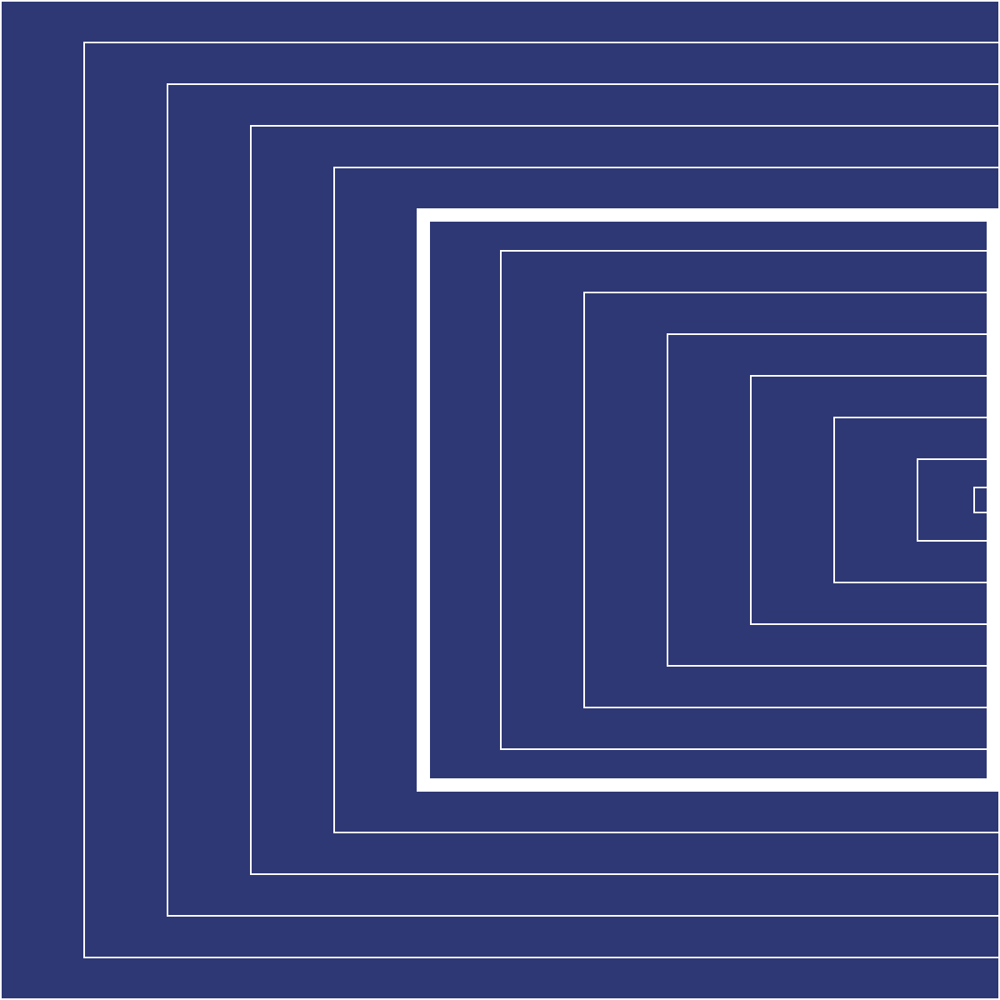
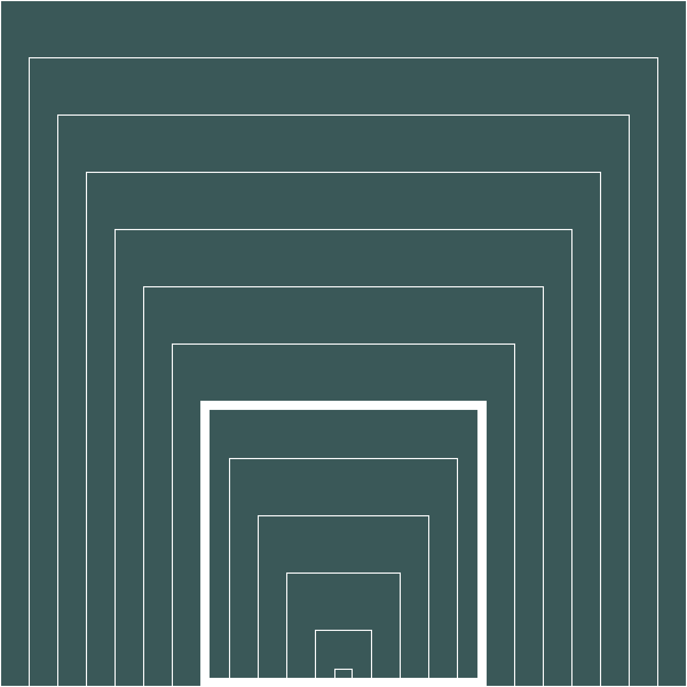
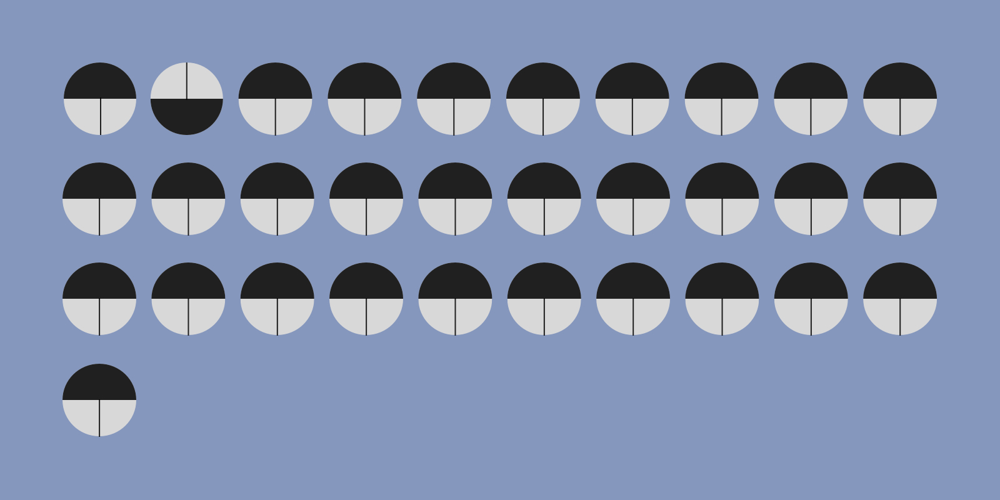
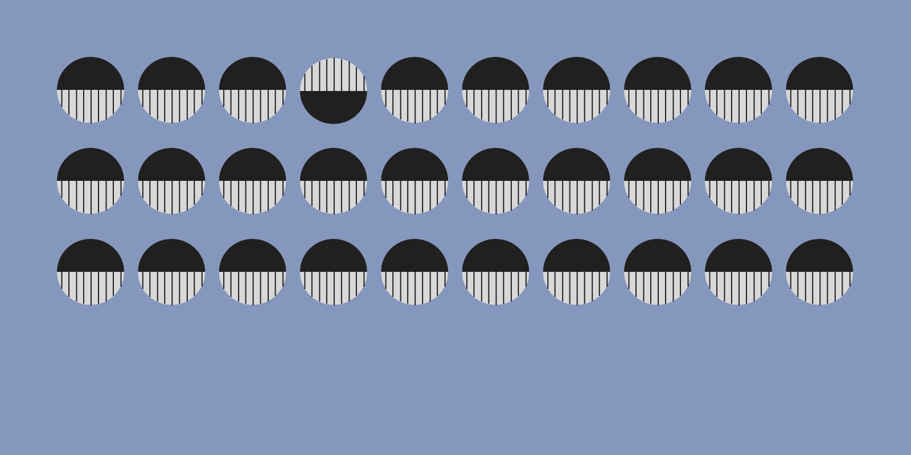

## Concept 2 / Month of the Year (value) & Day of the Month (Position)

Each month is represented by a different value. When it moves into each month, the duplicated circle represents which day of the month we are currently at, eg. 5 duplicated circles---> 5th day of the month. Duplicated circles carry the same value/color as the month they belong to.

*Related retinal variables: value & position

Third Day of January

End of January

16th day of March

10th day of October

## Concept 2 / Month of the Year (Sizes) & Quater of the Year (Hue)

Each month is represented by a smaller size square, as time proceed it moved more and more into the center. Hue of background color indicate which quater of the year it's at, totally there are four hues.

*Related retinal variables: size & orientation

February and First Quater of the Year

May and Second Quater of the Year

July and Third Quater of the Year

October and Four Quater of the Year

## Concept 3 / Month of the Year (Texture) & Day of the Month (Orientation)

Each month is represented by how many of lines that's created the pattern on the circle, eg. one line mean Jan... And the day of the month is represented by an upside down circle.

*Related retinal variables: Texture & Orientation*

2nd Day of Janurary

4th Day of September

