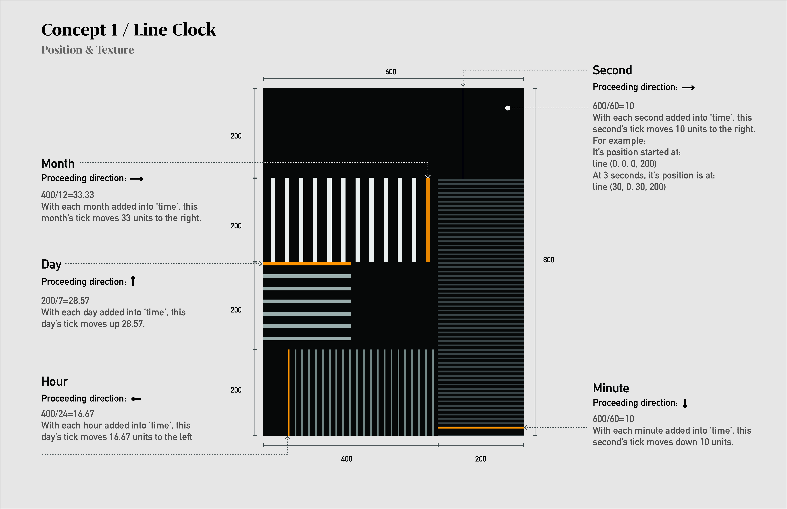
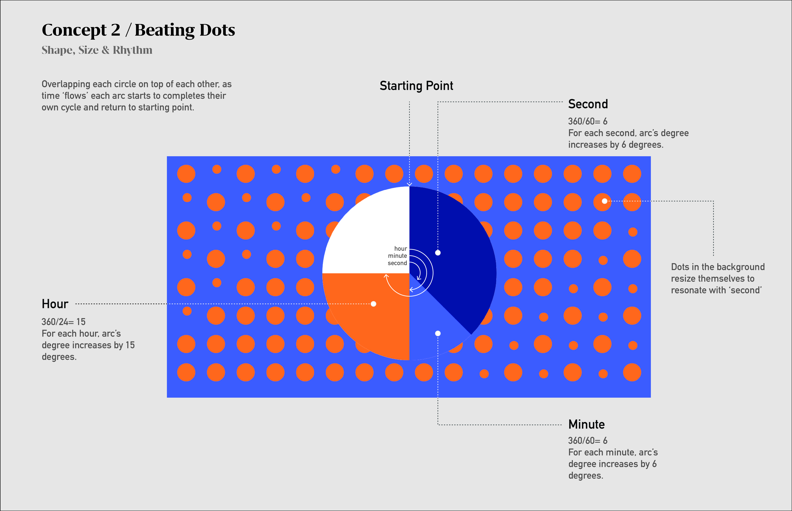
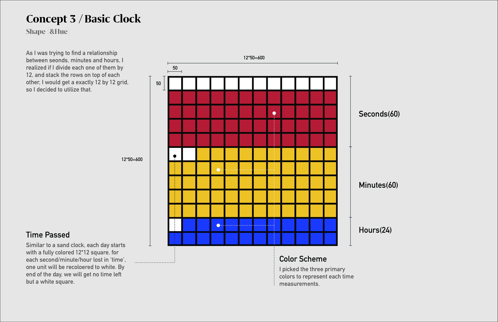

## Design Concepts

**Concept 1 / Line Clock**

Inspiration came from the fact that time has multiple directions depending how you may interpret it. In this design each measurement of time is given a different direction, with every second/minute/hour/day/month added into 'time', the link tick moves relative units along its direction.
*Related retinal variables: Position & Texture*

**Concept 2 / Beating Dots**

Overlapping each circle on top of each other, as time proceeds forward each arc starts to complete their own cycle and return to the starting point.
*Related retinal variables: Shape & Size*

**Concept 3 / Basic Clock**
Similar to a sand clock, each day starts with a fully colored 12*12 square, for each second/minute/hour lost in ‘time’, one unit will be recolored to white. By end of the day, we will get no 'time' left but a white square.
*Related retinal variables: Shape & Hue*

