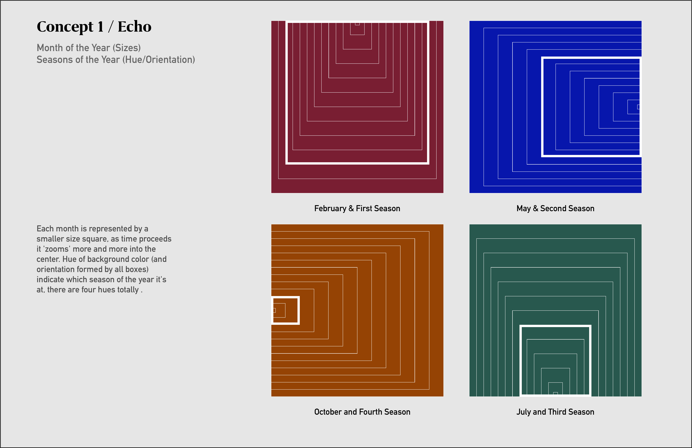
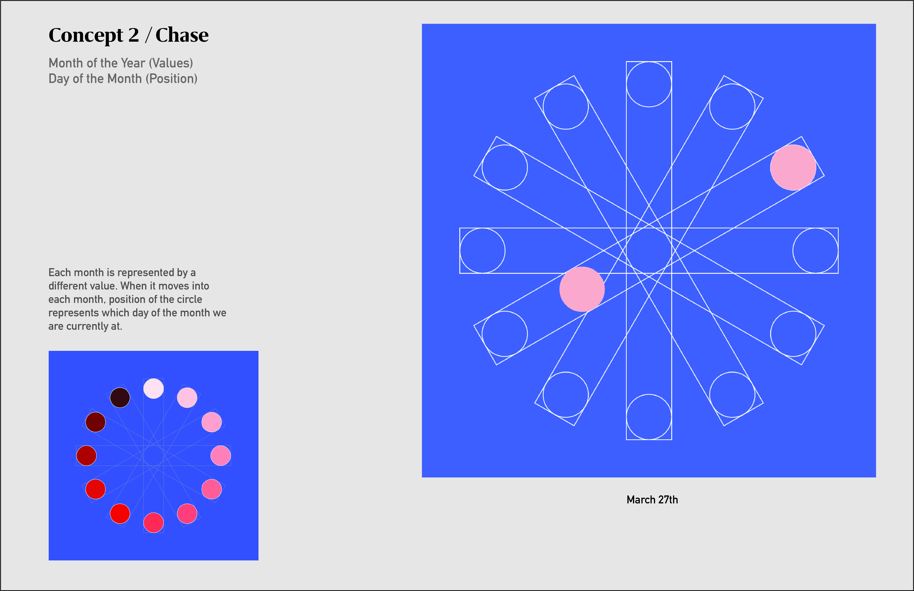

## Concept 1 / Echo

Each month is represented by a smaller size square, as time proceeds it 'zooms' more and more into the center. Hue of background color indicate which season of the year it's at, totally there are four hues.

***Sizes ---> Month of the Year (totally number:12)***
***Hue/Orientation--->Seasons of the Year (totally number:4)***

## Concept 2 / Chase

Each month is represented by a different value. When it moves into each month, position of the circle represents which day of the month we are currently at.

***Value ---> Month of the Year (totally number:12)***
***Position--->Day of the Month (totally number: varied by month)***

## Concept 3 / Pattern

Each month is represented by how many lines that's created the pattern inside the square, eg. one line mean Jan... And day of the week is represented by an upside down square.

***Texture ---> Month of the Year (totally number:12)***
***Orientation--->Day of the Week (totally number: 7)***

