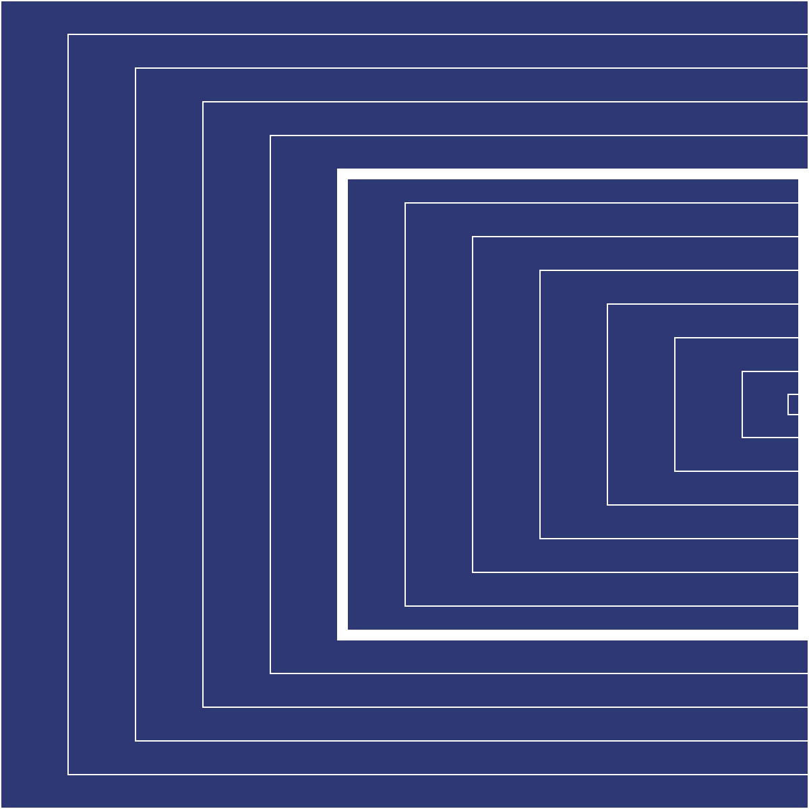
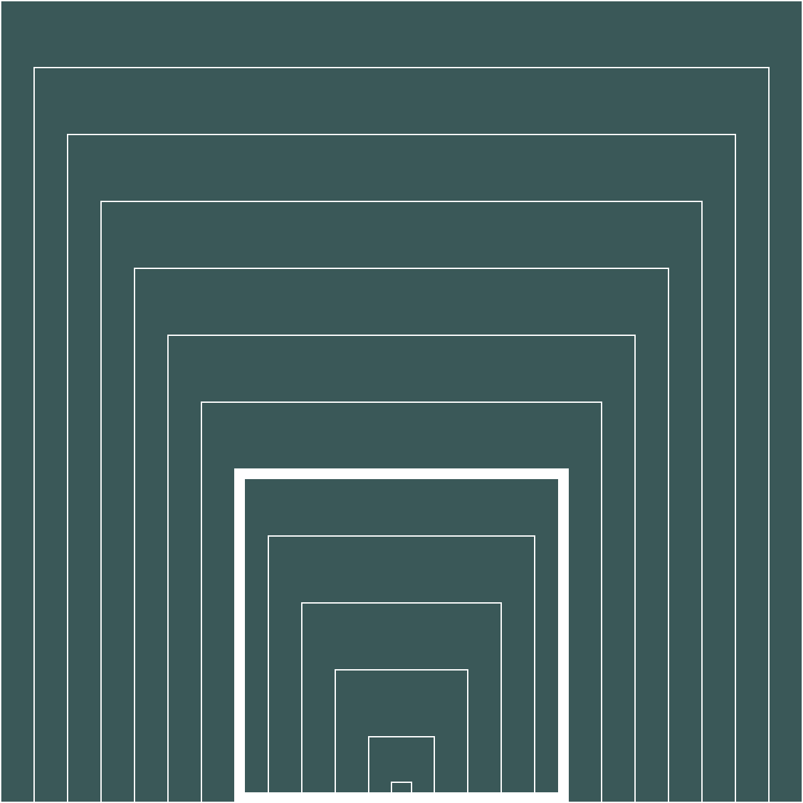

## Concept 1 / Month of the Year (Sizes) & Seasons of the Year (Hue/Orientation)

Each month is represented by a smaller size square, as time proceeds it 'zooms' more and more into the center. Hue of background color indicate which season of the year it's at, totally there are four hues.

*Related retinal variables: size & Hue/Orientation

February and First Season of the Year

May and Second Season of the Year

July and Third Season of the Year

October and Four Season of the Year

## Concept 2 / Month of the Year (Value) & Day of the Month (Position)

Each month is represented by a different value. When it moves into each month, position of the circle represents which day of the month we are currently at.

*Related retinal variables: Value & Position

5th day of March

16th day of July

## Concept 3 / Month of the Year (Texture) & Day of the Week (Orientation)

Each month is represented by how many lines that's created the pattern inside the square, eg. one line mean Jan... And day of the week is represented by an upside down square.

*Related retinal variables: Texture & Orientation*

A Tuesday in April

A Monday in December
