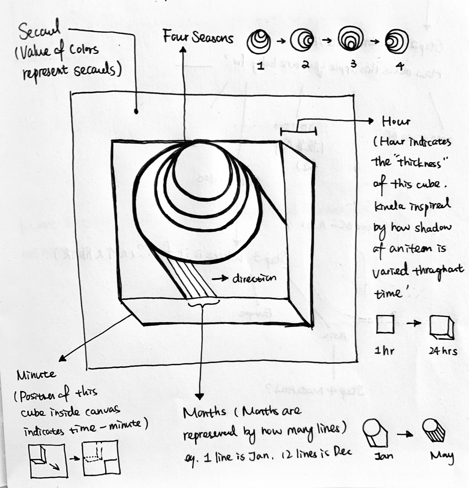

## Concept 1 

Looking at graphical representations of time throughout history, quite often we use the linear metaphor, such as 'timeline' or seconds and minutes' ticks in a physical clock. We speak of ‘long’ and ‘short’ times, of ‘intervals’ of ‘before’ and ‘after’ – all implicit metaphors which depend upon a mental picture of time as a linear continuum.

In this first concept I want to use retinal variables of a LINE (such as size, position, color etc.) to represent different aspect of TIME. The whole canvas is divided into two parts: foreground and background. Squares in the foreground indicate calendar values while elements in the backgroud represent clock time values.

Each month is represented by how many lines left inside the square that's created the pattern, eg. 12 (*2) line mean Jan... And day of the week is represented by a different orientated pill shape (which is formed by lines). In the background, left line is second's indicator, it's X coordinates moves towards right margin as ‘second’ proceeds. Right line is the minute's indicator, width of the line grows as ‘minute’ proceeds.  

***Texture ---> Month of the Year***
***Orientation--->Day of the Week***
***Position--->Second***
***Size--->Minute***
***Value--->Hour***

## Concept 2 

This concept was inspired by the fact that each timepoint is unique which means same timepoint won't happen again, for instance we won't experience another Sep 26th 2019 7:26:08. So I want to portrary this changeable characteristc of time by assigning time values to the moving points on the four edges of the square. As time proceeds, time values cause their position coordinates' values changing, we won't get the same shape (overlapped part) as well as the color value that's been assigned with two different time attributes.

***Value ---> Month of the Year and Week of the Month***
***Position--->Second & Minute***
***Shape--->Current Time***

## Concept 3 

Ancient people were looking at object's shadow  as well as sun's positions to deterine 'time'. In this concpet I want to utilize the retinal variable SIZE (mimic a sense of SHADOW) to indicate value of HOUR and POSITION ( or MOVEMENT) of the middle cube to represent MINUTE. As "MINUTE" increases, the middle cube moves along the diagonal line from top left to bottom right. SECOND as another clock-time variable is linked with background color's value because in nature the sunlight we perceived is different from second to second. Changing of SEASONS is depicted by grouping orientation of four interlinked circles and MONTHS are represented by how many lines that's contained inside the shape.

***Size ---> Hour***
***Position--->Minute***
***Value--->Second***
***Seasons--->Orientation***
***Pattern--->Month***

