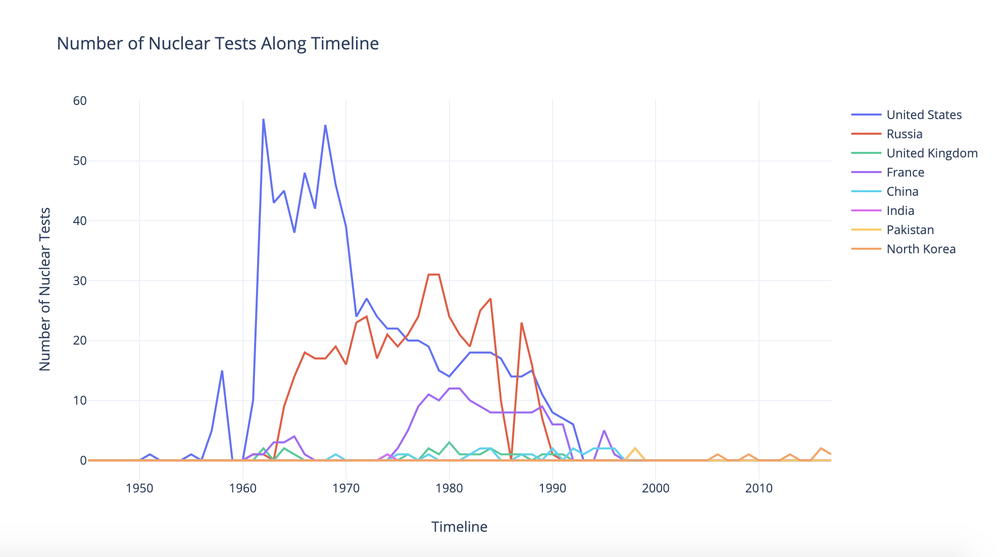
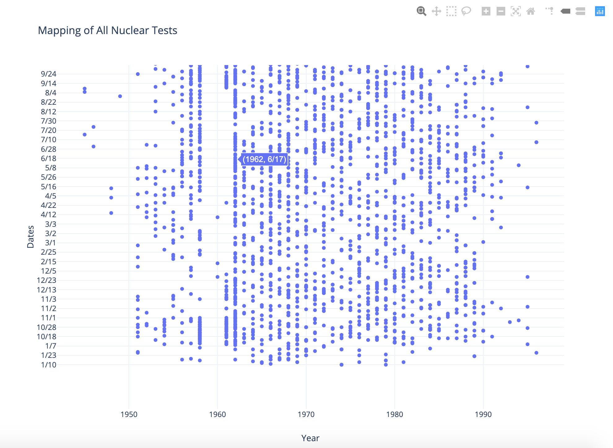
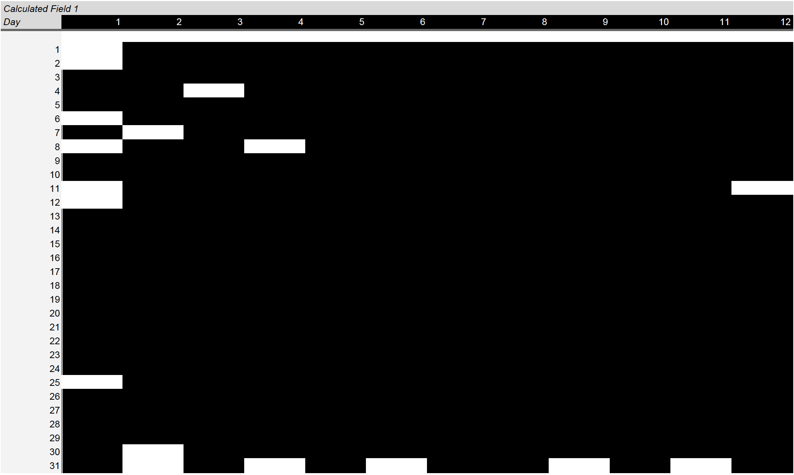
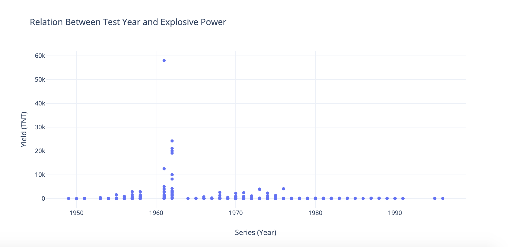
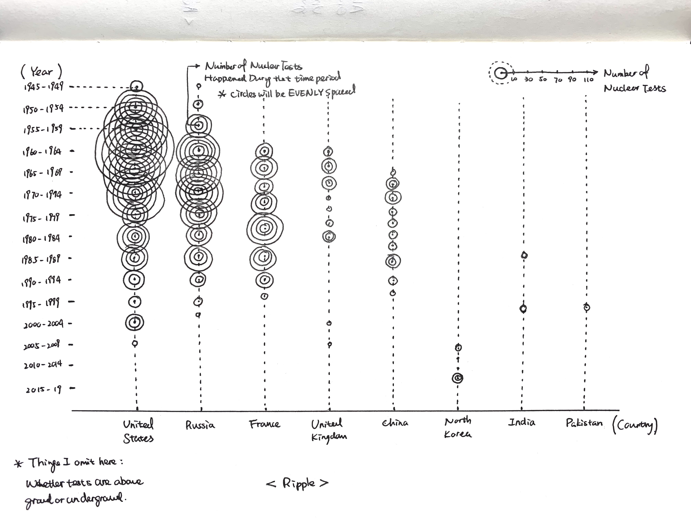
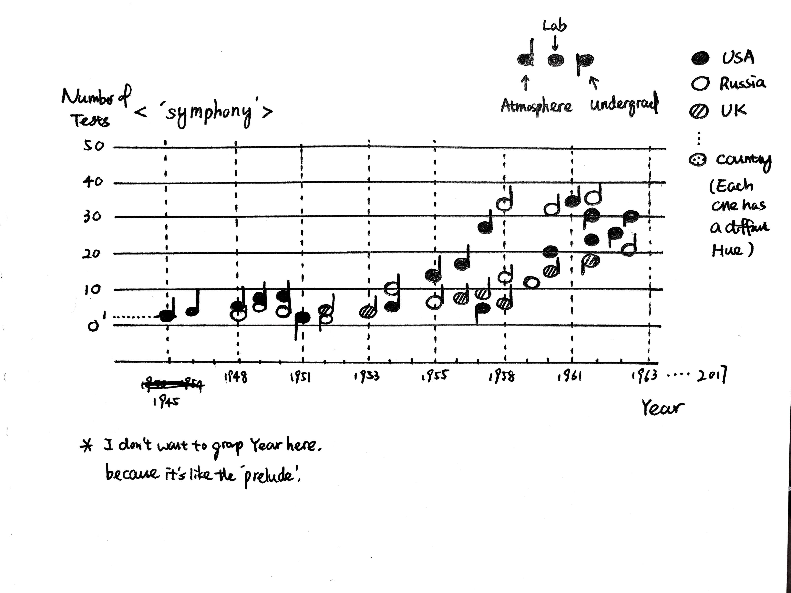

## Exploratory Visualizations
**EV1 Test Quantity & Timeline (Line Chart)**

This exploration indicates that there is an inclined tendency of nuclear testing after 1960, and united states has almost double the quantity of nuclear tests compare to Russia.

**EV2 Special Date (Table)**

This visualization explored the pattern of nuclear tests' dates, in 1.2.2 you can see among all dates within a year throughout the whole history of nuclear testing, surprisingly there are some dates that didn't have any tests.

**EV3 Test Year & Explosive Power (Scatter Plot)**

This visualization explored the relationship between tests' year when it happened and its explosive power (measured in TNT).

## Pencil Sketches

**Concept 1 Ripple:**

As I was observing the tests data, the quantity of tests happened along the timeline almost feel like a ripple effect between countries so I want to reveal that through this data visualization. In this sketch each circle represents certain amount of tests, just like what people used to show the epicenter of an earthquake, each point is at the crossroads of one country name and one time interval. Circles may overlap with each other, but they will be equally spaced.

**Concept 2 Symphony**

We can see from the table United States was the first country which conducted the nuclear test, then Russia joined the party so as other countries followed. Nuclear test is normally associated milltary and power so I want to use visual symbols which is exactly the opposite to set the contrast (or being sarcastic）. Each nuclear test is a music note in this sketch (the vertical bar also indicates whether this test was took place above or below ground) together they compose a 'symphony'. 

**Concept 3 Net:**

Normally we would plot years along a straight line, in this concept I want to try something different as plotting years with angles. Using small multiple methods, together we can compare the nuclear tests quantity among countries as well as within the time dimension.
And in this concept I want to addin infant mortality rate, resource can be found here: https://ourworldindata.org/grapher/youth-mortality-rate?year=1978

_Net.jpg)

