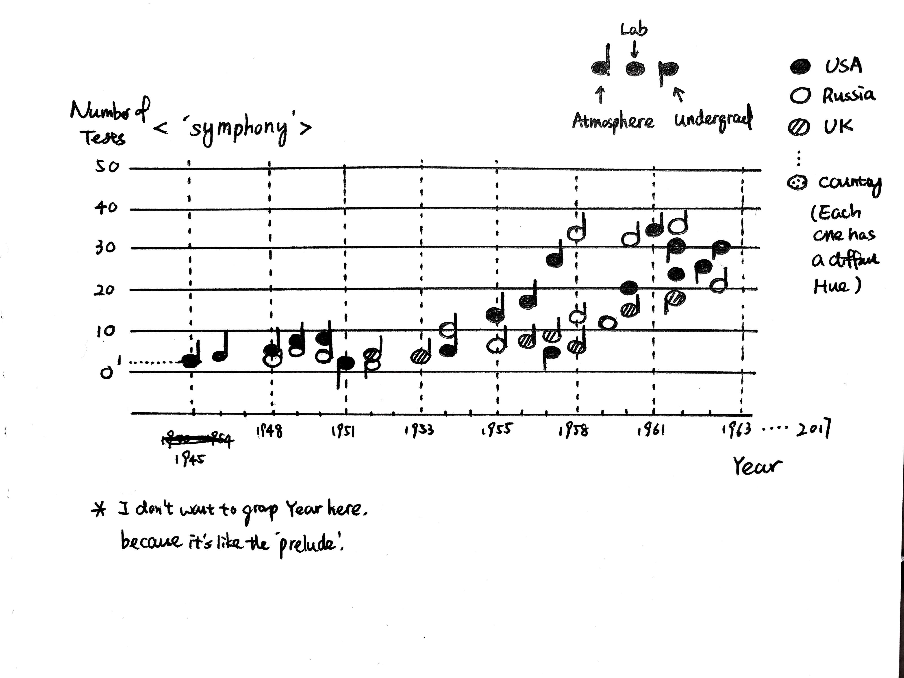
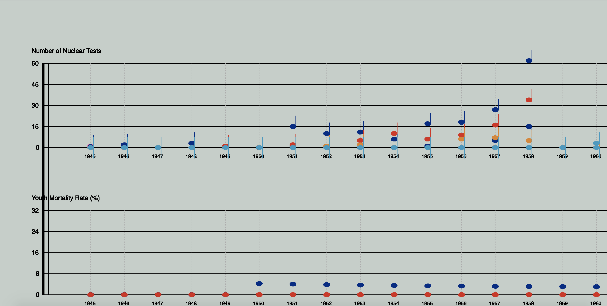
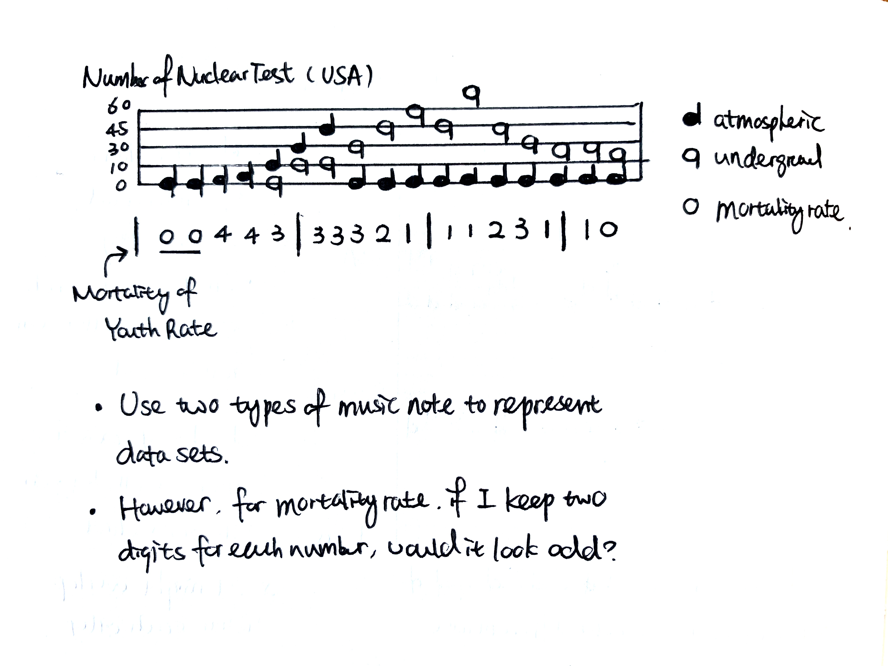
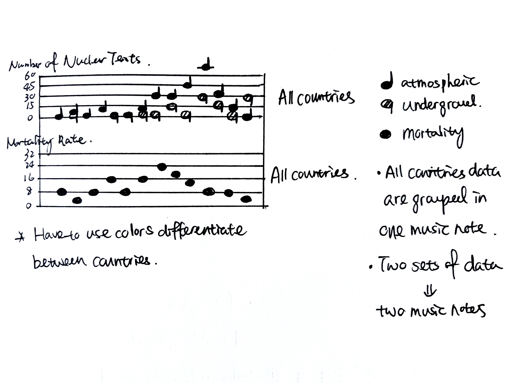
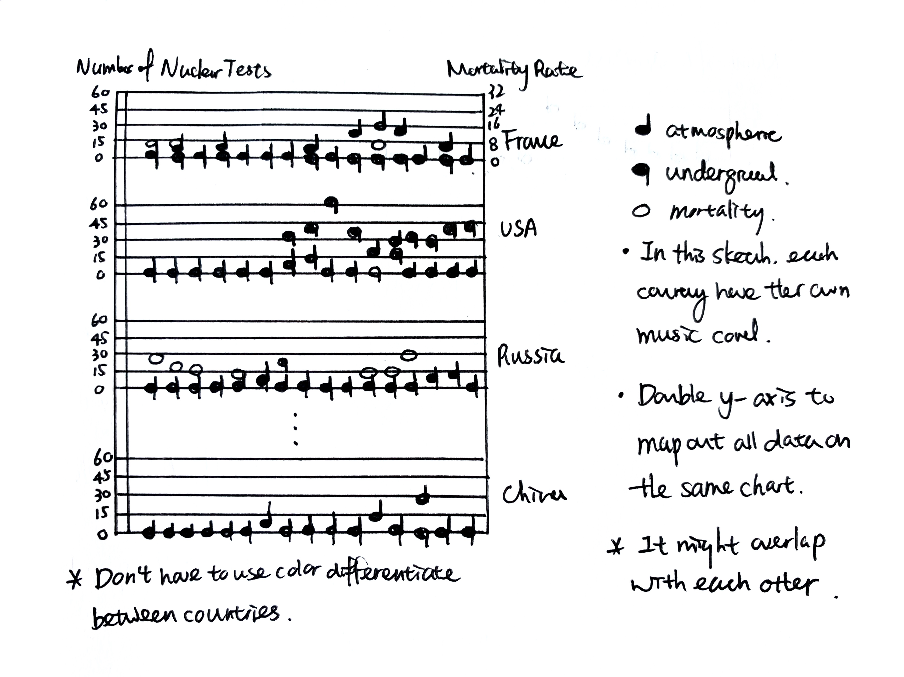

## Concept

After I observed the dataset which was given to us, I realized that United States was the first country which conducted the nuclear test, then Russia joined the party so as other countries followed. Nuclear test is normally associated military and power so I want to use visual symbols which is exactly the opposite to set the contrast (or being sarcastic). Each nuclear test is a music note in this sketch (the vertical bar of each music note also indicates whether this test was took place above or below ground) together they compose a 'symphony'.

## Pencil Sketches




## First Iterations

**After my first draft I realized several problems:**
 - Each country's data points overlap with each other, especially for the 'zero' value. With opaque color fills, it's very had to distinguish how many data points lay on top of each other.
 - At first I was trying to extract one main color from each country's flag...then I found out many countries' flags are composed of blue, red and white so it's not a good strategy.

Then I explored different layout options, try to find a way to better map out both data sets.




Some javascript codes, for more details please visit [here](https://github.com/Xingwei726/dvia-2019/blob/master/2.mapping-quantities/project/sketch.js)
```javascript
    //1.US Atmospheric  
    x = 200;
    x1 = 100;
    var colWidth2 = 50;
    for (var r = 0; r < table.getRowCount(); r++) {
        var value = table.getNum(r, 1);//1
        var value2 = map(value, 0, 60, y2 + d * 2, 300)
        fill(0,40+value*15);
        ellipse(x, 450 - value2, 13, 8);
        push();
        // stroke(pal.colorForValue(value));
        stroke(0,40+value*15);
        strokeWeight(lw);
        line(x + 6, 451 - value2, x + 6, 428 - value2)
        pop();
        x += colWidth2
    }

    //1.US Underground  
    x = 200;
    x1 = 100;
    var colWidth2 = 50;
    for (var r = 0; r < table2.getRowCount(); r++) {
        var value = table2.getNum(r, 1);//1
        var value2 = map(value, 0, 60, y2 + d * 2, 300)
        fill(0,40+value*15);
        ellipse(x, 450 - value2, 13, 8);
        push();
        stroke(0,40+value*15);
        strokeWeight(lw);
        line(x + 6, 451 - value2, x + 6, 472 - value2)
        pop();
        x += colWidth2
    }

    //1.US Milestone
    ls = 10;//distance between two lines
    push();
    stroke(50, 34, 255);
    strokeWeight(2);
    
    //1945
    line(200, 0 + y1, 5 + 200, 10 + y1);
    line(200 - 5, 10 + y1, 200, 0 + y1);
    line(200, 0 + y1 + ls, 5 + 200, 10 + y1 + ls);
    line(200 - 5, 10 + y1 + ls, 200, 0 + y1 + ls);
    line(200, 0 + y1 + ls * 2, 5 + 200, 10 + y1 + ls * 2);
    line(200 - 5, 10 + y1 + ls * 2, 200, 0 + y1 + ls * 2);
    //1952
    line(200 + 50 * 7, 0 + y1, 5 + 200 + 50 * 7, 10 + y1);
    line(200 - 5 + 50 * 7, 10 + y1, 200 + 50 * 7, 0 + y1);
    line(200 + 50 * 7, 0 + y1 + ls, 5 + 200 + 50 * 7, 10 + y1 + ls);
    line(200 - 5 + 50 * 7, 10 + y1 + ls, 200 + 50 * 7, 0 + y1 + ls);

    //1954
    line(200 + 50 * 9, 0 + y1, 5 + 200 + 50 * 9, 10 + y1);
    line(200 - 5 + 50 * 9, 10 + y1, 200 + 50 * 9, 0 + y1);
    pop();
    push();
    textFont("Helvetica")
    textSize(12);
    fill(50, 34, 255);
    noStroke();
    text('1', 200+10, 10 + y1);
    text('2', 200+10, 10 + y1 + ls);
    text('3', 200+10, 10 + y1 + ls*2);
    text('4', 200+10+ 50 * 7, 10 + y1);
    text('5', 200+10+ 50 * 7, 10 + y1 + ls);
    text('6', 200+10+ 50 * 9, 10 + y1);
    pop();

```

## Connect with Music Notes
I used **p5 sound library** and **mousePressed** function to connect this data visualization with actually music notes.

```javascript
function playNote(note, duration) {
  osc.freq(midiToFreq(note));
  // Fade it in
  osc.fade(0.5,0.2);

  // If we sest a duration, fade it out
  if (duration) {
    setTimeout(function() {
      osc.fade(0,0.3);
    }, duration-50);
  }
}


function mousePressed(event) {
  if(event.clientX < width && event.clientY >140 && event.clientY<255) {
    // Map mouse to the key index
    let key = floor(map(mouseY, 140, 251, 0, notes.length));
    playNote(notes[key]);
  } else if(event.clientX < width && event.clientY > 300 && event.clientY<455) {
    let key = floor(map(mouseY, 300, 451, 0, notes.length));
    playNote(notes[key]);
  }else if(event.clientX < width && event.clientY > 540 && event.clientY<655) {
    let key = floor(map(mouseY, 540, 655, 0, notes.length));
    playNote(notes[key]);
  }else if(event.clientX < width && event.clientY > 740 && event.clientY<855) {
    let key = floor(map(mouseY, 740, 850, 0, notes.length));
    playNote(notes[key]);
  }else if(event.clientX < width && event.clientY > 950 && event.clientY<1050) {
    let key = floor(map(mouseY, 950, 1050, 0, notes.length));
    playNote(notes[key]);
  }else if(event.clientX < width && event.clientY > 1150 && event.clientY<1250) {
    let key = floor(map(mouseY, 1150, 1250, 0, notes.length));
    playNote(notes[key]);
  }else if(event.clientX < width && event.clientY > 1350 && event.clientY<1450) {
    let key = floor(map(mouseY, 1350, 1450, 0, notes.length));
    playNote(notes[key]);
  }else if(event.clientX < width && event.clientY > 1550 && event.clientY<1650) {
    let key = floor(map(mouseY, 1550, 1650, 0, notes.length));
    playNote(notes[key]);
  }
}
// Fade it out when we release
function mouseReleased() {
  osc.fade(0,0.5);
}

``

## Final Print Poster

